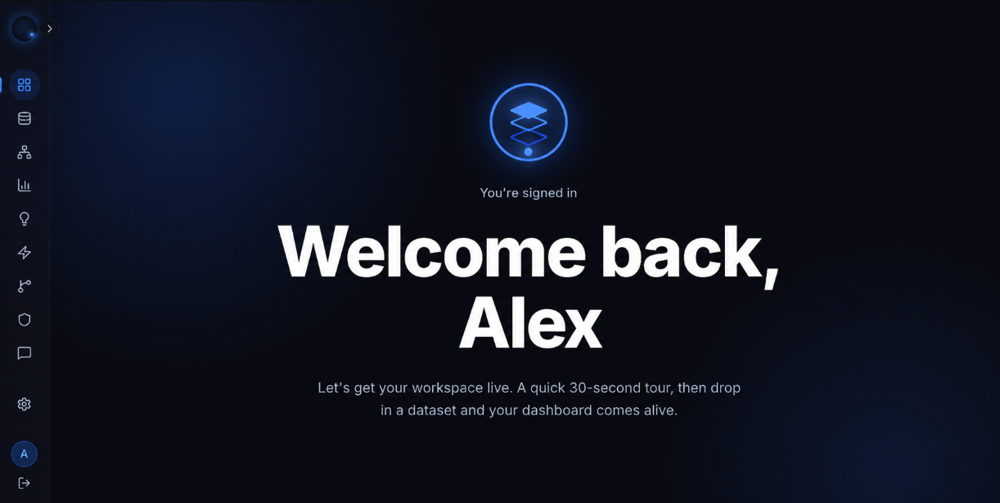

<div align="center">

# Numerate OS

### Deterministic Analytics. Verified Intelligence.

An enterprise analytics platform where every metric is computed by deterministic systems before AI is ever allowed to explain it.

<br>

<p>
  <a href="#overview"><strong>Overview</strong></a> •
  <a href="#architecture"><strong>Architecture</strong></a> •
  <a href="#core-capabilities"><strong>Capabilities</strong></a> •
  <a href="#quick-start"><strong>Quick Start</strong></a> •
  <a href="#tech-stack"><strong>Tech Stack</strong></a> •
  <a href="#roadmap"><strong>Roadmap</strong></a>
</p>

<br>


### [**Try the live app →**](https://numerate-qxc4wt62h-aadhar.vercel.app)

---

## Dashboard Preview

<p align="center">
  
</p>

<br>

**32K+ Lines of Production Code** • **14 Backend Routers** • **32 Frontend Routes** • **11 Statistical & Machine Learning Engines** • **Deterministic Rule Engine** • **SQL Copilot** • **RAG Knowledge Base**

</div>

---

## Overview

> **Numerate OS separates mathematics from language.**

Modern analytics platforms often ask AI to both calculate and explain business metrics.

Numerate OS intentionally separates these responsibilities.

---

### Deterministic Layer

- Computes KPIs
- Performs statistical analysis
- Detects anomalies
- Generates forecasts
- Validates every metric

↓

### Artificial Intelligence

- Explains results
- Answers business questions
- Writes executive summaries
- Produces recommendations

---

The language model never produces numbers.

It only communicates computation that has already been verified.

---

# Engineering Philosophy

Most AI analytics platforms follow a familiar pipeline.

```
                            Data
                              │
                              ▼
                             LLM
                              │
                              ▼
                            Charts
```

Numerate OS deliberately reverses that relationship.

```
                            Data
                              │
                              ▼
                  Deterministic Analytics
                              │
                              ▼
                        Verification
                              │
                              ▼
                  Artificial Intelligence
                              │
                              ▼
                    Business Explanation
```

The difference appears subtle.

In practice, it changes the entire reliability model of the platform.

---

# Design Principles

The project follows four engineering principles that influence every subsystem.

| Principle | Description |
|-----------|-------------|
| Deterministic First | Business logic, analytics and mathematical computation never depend on an LLM. |
| Explainable by Default | Every insight can be traced back to the computation that produced it. |
| Human-Centered Engineering | Every feature is designed to remain understandable for both developers and business users. |
| Production Before Demonstration | Systems are implemented with maintainability, scalability and operational reliability as primary goals. |

---

# Core Capabilities

<table>
<tr>

<td width="33%" valign="top">

### Analytics Engine

Deterministic statistical analysis powered by Python, DuckDB and classical analytical methods.

<br>

- Exploratory Data Analysis
- Correlation Analysis
- Time Series Analysis
- Forecasting
- Regression
- Classification
- Clustering
- Outlier Detection

</td>

<td width="33%" valign="top">

### AI Copilot

Natural-language interface backed by real SQL execution instead of generated answers.

<br>

- SQL Generation
- Query Execution
- Context-Aware Responses
- Verified Results
- Explainable Reasoning

</td>

<td width="33%" valign="top">

### Insight Engine

Autonomous business insight generation with deterministic verification before publication.

<br>

- Trend Detection
- Risk Analysis
- Operational Insights
- Data Quality Checks
- Executive Summaries

</td>

</tr>
</table>

---

# Platform Workflow

```text
                       Upload Dataset
                              │
                              ▼
                   Schema Identification
                              │
                              ▼
               Deterministic Analytics Engine
                              │
                              ▼
                 Insight Verification Layer
                              │
                              ▼
                  Artificial Intelligence
                              │
                              ▼
               Executive Summary & Dashboard
```

---

# Why Numerate OS Exists

Business decisions should not depend on convincing paragraphs.

They should depend on verifiable computation.

Numerate OS exists to bridge the gap between modern language models and traditional analytical systems by allowing each to focus on what it does best.

Deterministic engines perform mathematics.

Artificial intelligence communicates the outcome.

That separation creates a platform capable of producing analytical results that remain transparent, reproducible and trustworthy even as the surrounding AI ecosystem continues to evolve.

---

<div align="center">

### Every business decision begins with a number.

### Every number should come from deterministic computation.

### Everything else is explanation.

</div>

---

# Capabilities

Numerate OS is organized around independent analytical systems.

Each subsystem has a single responsibility, deterministic execution, and clearly defined boundaries. Artificial intelligence augments these systems only after their outputs have been computed and verified.

---

## Data Ingestion

The platform accepts structured datasets from multiple business domains and automatically prepares them for deterministic analysis.

<table>
<tr>
<td width="50%">

#### Automatic Schema Discovery

The ingestion pipeline identifies dataset structure without requiring manual configuration.

- Revenue detection
- Date recognition
- Currency normalization
- Customer identification
- Category mapping
- Duplicate detection
- Missing value profiling
- Intelligent type inference

</td>

<td width="50%">

#### Supported Business Data

- Sales Reports
- Bank Statements
- SaaS Metrics
- CRM Exports
- Payment Ledgers
- Accounting Reports
- Operational Logs
- Financial Statements

</td>
</tr>
</table>

---

## Deterministic Analytics Engine

Every analytical result is produced through deterministic computation before artificial intelligence becomes involved.

<table>
<tr>

<td width="33%" valign="top">

### Statistical Analysis

- Descriptive Statistics
- Distribution Analysis
- Correlation Matrix
- Variance Analysis
- Percentiles
- Frequency Analysis

</td>

<td width="33%" valign="top">

### Predictive Analytics

- Linear Regression
- Forecasting
- Time Series
- Trend Detection
- Growth Analysis
- Confidence Intervals

</td>

<td width="33%" valign="top">

### Machine Learning

- Classification
- Clustering
- Regression Models
- Feature Relationships
- Pattern Discovery
- Similarity Analysis

</td>

</tr>
</table>

---

## SQL Copilot

Instead of generating confident guesses, the Copilot converts natural language into executable SQL.

Every response follows the same execution pipeline.

```text
                      Natural Language
                              │
                              ▼
                       SQL Generation
                              │
                              ▼
                         Validation
                              │
                              ▼
                      DuckDB Execution
                              │
                              ▼
                    Result Verification
                              │
                              ▼
                       AI Explanation
```

The executed query remains visible, allowing every answer to be independently audited.

---

## Deep Insights Engine

The platform continuously analyzes datasets across multiple analytical dimensions without requiring user prompts.

| Analytical Dimension | Purpose |
|----------------------|---------|
| Trend Analysis | Detect long-term movement and growth patterns |
| Anomaly Detection | Surface statistical outliers |
| Operational Insights | Discover workflow inefficiencies |
| Category Analysis | Compare business segments |
| Risk Assessment | Highlight potential business risks |
| Seasonality | Identify recurring temporal patterns |
| Data Quality | Detect structural inconsistencies |

Only the strongest verified insights are presented to users.

---

## Executive Intelligence

Instead of producing generic summaries, the platform generates executive briefings grounded entirely in verified analytical outputs.

The summary engine combines deterministic computation with language generation while maintaining complete separation between mathematics and narration.

Executive reports include:

- Business Overview
- KPI Summary
- Significant Trends
- Critical Findings
- Operational Risks
- Recommended Actions
- Confidence Indicators

---

## Knowledge Retrieval

Business knowledge can be stored alongside datasets and retrieved through semantic search.

The retrieval pipeline uses a two-stage architecture.

```text
                       Knowledge Base
                              │
                              ▼
                     Vector Embeddings
                              │
                              ▼
                      Semantic Search
                              │
                              ▼
                  Cross Encoder Re-ranking
                              │
                              ▼
                     Context Selection
                              │
                              ▼
                        LLM Response
```

Only the highest-ranked contextual information is supplied to the language model.

---

## Deterministic Rules Engine

Business rules operate independently from artificial intelligence.

Rules continuously monitor incoming analytical results and trigger actions whenever predefined thresholds are exceeded.

Supported capabilities include:

- Revenue Monitoring
- KPI Thresholds
- Statistical Alerts
- Operational Conditions
- Dataset Health Monitoring
- Trend-Based Triggers
- Notification Routing

Each triggered event is persisted for auditing and historical analysis.

---

## Confidence Center

Every AI-generated statement is evaluated against deterministic evidence before being presented.

Each insight is assigned a verification status based on independent validation.

| Status | Meaning |
|---------|----------|
| Verified | Statement fully supported by deterministic computation |
| Partially Verified | Evidence exists but requires manual interpretation |
| Unverified | Insufficient evidence available |

Rather than hiding uncertainty, the platform exposes it.

---

## Reports

Reports are generated directly from deterministic analytical results.

Supported exports include:

- Executive Reports
- KPI Summaries
- Statistical Reports
- Forecast Reports
- PDF Exports
- Shareable Dashboards

All exported values originate from verified computation.

---

## What Makes Numerate OS Different

Traditional AI analytics systems generally follow this workflow.

```text
                           Dataset
                              │
                              ▼
                       Language Model
                              │
                              ▼
                           Charts
```

Numerate OS follows a different architecture.

```text
                           Dataset
                              │
                              ▼
                 Deterministic Computation
                              │
                              ▼
                  Statistical Verification
                              │
                              ▼
                   Business Intelligence
                              │
                              ▼
                  Artificial Intelligence
                              │
                              ▼
                     Human Explanation
```

The distinction is architectural rather than cosmetic.

Artificial intelligence communicates verified computation.

It never replaces it.

---

# Architecture

Numerate OS is designed as a layered analytical platform where deterministic computation remains completely isolated from language generation.

Every subsystem has a single responsibility.

Business logic never depends on an LLM.

Artificial intelligence operates only after computation has already been completed and verified.

---

# High-Level Architecture

```text
                       Dataset Upload
                              │
                              ▼
                      Schema Detection
                              │
                              ▼
                      Analytics Engine
                              │
                              ▼
                     Verification Layer
                              │
                              ▼
                   Business Intelligence
                              │
                              ▼
                        AI Services
                              │
                              ▼
                         Dashboard
```

---

# System Architecture

```text
Next.js Frontend

    ↓

FastAPI Backend

    ↓

├── DuckDB Analytics Engine
├── PostgreSQL
├── Rules Engine → Notification Center
├── AI Gateway → RAG Pipeline
└── PDF Generator
```

---

# Request Lifecycle

Every request follows a deterministic execution path before AI becomes involved.

```text
                            User
                              │
                              ▼
                          Frontend
                              │
                              ▼
                          Backend
                              │
                              ▼
                      Analytics Engine
                              │
                              ▼
                      Verified Results
                              │
                              ▼
                         AI Gateway
                              │
                              ▼
                        Explanation
                              │
                              ▼
                     Dashboard Rendered
```

---

# AI Lifecycle

Artificial intelligence never receives raw business requests.

It receives verified analytical context.

```text
                          Question
                              │
                              ▼
                          Planner
                              │
                              ▼
                       SQL Generator
                              │
                              ▼
                           DuckDB
                              │
                              ▼
                        Verification
                              │
                              ▼
                      Context Builder
                              │
                              ▼
                            LLM
                              │
                              ▼
                     Verified Response
```

---

# Analytics Pipeline

Every uploaded dataset passes through a deterministic analytical pipeline.

```text
                             CSV
                              │
                              ▼
                         Validation
                              │
                              ▼
                      Schema Detection
                              │
                              ▼
                      Column Inference
                              │
                              ▼
                         Profiling
                              │
                              ▼
                    Statistical Analysis
                              │
                              ▼
                        Forecasting
                              │
                              ▼
                     Insight Generation
                              │
                              ▼
                        Verification
                              │
                              ▼
                         Dashboard
```

---

# Data Flow

```text
                          Dataset
                              │
                              ▼
                         Validation
                              │
                              ▼
                          Cleaning
                              │
                              ▼
                      Schema Detection
                              │
                              ▼
                           DuckDB
                              │
                              ▼
                         Analytics
                              │
                              ▼
                       Business Rules
                              │
                              ▼
                      Verified Results
                              │
                              ▼
                       AI Explanation
                              │
                              ▼
                         Dashboard
```

---

# Core Services

| Service | Responsibility |
|----------|----------------|
| API Gateway | Entry point for all client requests |
| Analytics Engine | Deterministic statistical computation |
| SQL Copilot | Natural language to executable SQL |
| Deep Insights Engine | Autonomous business analysis |
| Rules Engine | Threshold monitoring and event generation |
| Verification Layer | Validates AI outputs against deterministic evidence |
| AI Gateway | Provider routing, retries and orchestration |
| Knowledge Retrieval | Semantic search and contextual retrieval |
| Report Generator | Server-side PDF generation |
| Notification Service | Event persistence and alert delivery |

---

# Repository Structure

```text
numerate-os/

├── frontend/
│
│   ├── app/
│   ├── features/
│   ├── components/
│   ├── hooks/
│   ├── services/
│   ├── providers/
│   ├── stores/
│   ├── types/
│   ├── lib/
│   └── utils/
│
├── backend/
│
│   ├── api/
│   ├── analytics/
│   ├── ai/
│   ├── auth/
│   ├── database/
│   ├── models/
│   ├── repositories/
│   ├── services/
│   ├── schemas/
│   ├── rules/
│   ├── reports/
│   ├── notifications/
│   └── core/
│
├── docs/
│
├── docker/
│
├── scripts/
│
└── tests/
```

---

# Backend Layers

```text
                     Presentation Layer
                              │
                              ▼
                         API Layer
                              │
                              ▼
                     Business Services
                              │
                              ▼
                      Analytics Engine
                              │
                              ▼
                        Repositories
                              │
                              ▼
                          Database
```

Every layer has clearly defined boundaries.

Business logic never exists inside API routes.

Database models never leak into the presentation layer.

Analytics remain independent from AI.

---

# Frontend Architecture

```text
                            Pages
                              │
                              ▼
                      Feature Modules
                              │
                              ▼
                    Reusable Components
                              │
                              ▼
                           Hooks
                              │
                              ▼
                      State Management
                              │
                              ▼
                         API Client
                              │
                              ▼
                           Backend
```

Each feature owns its own components, state and business logic.

Shared components remain framework-agnostic whenever possible.

---

# AI Architecture

The language model is intentionally positioned as the final layer of the analytical pipeline.

```text
                       Verified Data
                              │
                              ▼
                      Context Builder
                              │
                              ▼
                      Prompt Assembly
                              │
                              ▼
                      Provider Gateway
                              │
                              ▼
                            LLM
                              │
                              ▼
                        Verification
                              │
                              ▼
                     Response Formatter
                              │
                              ▼
                          Frontend
```

This prevents language models from influencing analytical computation.

Instead, they communicate computation that has already been verified.

---

# Design Decisions

| Decision | Reason |
|----------|--------|
| DuckDB | Fast analytical execution over uploaded datasets |
| PostgreSQL | Durable application state and metadata |
| FastAPI | High-performance API layer with strong typing |
| Next.js | Scalable frontend architecture |
| LiteLLM | Provider abstraction without vendor lock-in |
| pgvector | Efficient semantic retrieval |
| Celery | Asynchronous processing for long-running tasks |
| Redis | Queueing, caching and distributed coordination |

---

# Engineering Principles

Every subsystem inside Numerate OS follows the same engineering philosophy.

- Deterministic computation always precedes language generation.
- Business logic remains independent from AI providers.
- Every analytical result is reproducible.
- Every insight can be audited.
- Every module has a single responsibility.
- Clear boundaries exist between frontend, backend, analytics and AI.
- Components are organized by responsibility rather than technology.
- Scalability and maintainability take priority over short-term convenience.

---

# Architectural Summary

Numerate OS is not an AI application with analytics attached.

It is an analytics platform with an AI communication layer.

That distinction defines every architectural decision throughout the repository.

---

# Engineering Validation

Reliable analytics are not achieved by producing convincing outputs.

They are achieved by refusing to trust outputs until they have been independently verified.

Throughout development, every analytical engine inside Numerate OS was treated as a system that required validation rather than assumption.

No metric was accepted because it appeared reasonable.

Every calculation was independently reproduced and compared before it was considered correct.

---

# Validation Strategy

Each analytical module was evaluated against independently prepared datasets covering different business domains.

| Dataset | Validation Focus |
|----------|------------------|
| Retail Sales | Revenue aggregation, category analysis, forecasting |
| SaaS Metrics | Growth trends, subscriptions, churn metrics |
| Banking Transactions | Transaction summaries, anomaly detection |
| Corporate Payments | Statistical profiling, operational insights |
| Digital Wallet | Category breakdown, spending analysis |
| CRM Exports | Customer segmentation, clustering |
| Accounting Reports | Financial summaries and KPI accuracy |

Every dataset was analyzed through separate validation scripts before results were accepted.

---

# Independent Verification

Application outputs were never trusted by default.

For every major analytical feature:

1. Execute the analysis inside Numerate OS.
2. Reproduce the same calculation using an isolated Python script.
3. Compare every numerical output.
4. Treat any mismatch as a defect regardless of magnitude.

Only matching results were accepted.

This validation process was repeated throughout development whenever analytical logic changed.

---

# Validation Workflow

```text
                      Business Dataset
                              │
                              ▼
                        Numerate OS
                              │
                              ▼
                     Generated Results
                              │
                              ▼
              Independent Python Verification
                              │
                              ▼
                      Result Comparison
                              │
                              ▼
                            Match
                              │
                              ▼
                           Accepted
```

---

# Engineering Issues Discovered

The validation process surfaced several implementation defects that would have been difficult to detect through visual inspection alone.

## Schema Detection Collision

Revenue identification originally relied on substring matching.

A dataset containing a column named `Narration` unintentionally matched the pattern intended for `ARR`, causing textual values to be interpreted as revenue.

### Resolution

- Restricted inference to numeric columns.
- Improved pattern matching.
- Added validation rules before aggregation.

---

## Unsupported Statistical Claims

An experimental AI response produced a future probability that was not supported by deterministic computation.

Although the language appeared convincing, the underlying analytical pipeline had no statistical basis for such a prediction.

### Resolution

- Removed unsupported predictive language.
- Added prompt-level constraints.
- Added post-generation validation filters.

---

## Weak Trend Detection

Trend analysis initially accepted grouped data regardless of sample size.

Small samples occasionally produced mathematically correct but statistically insignificant trends.

### Resolution

- Minimum sample thresholds introduced.
- Confidence requirements enforced.
- Weak trends automatically rejected.

---

## Route Resolution Conflict

A dynamic route intercepted requests intended for a static endpoint, resulting in incorrect request resolution.

### Resolution

- Static routes registered before dynamic routes.
- Routing behavior validated with integration tests.

---

## Frontend Runtime Failure

A chart component referenced visualization primitives that had not been imported.

The issue remained hidden until users interacted with the affected dashboard.

### Resolution

- Import validation.
- Component testing.
- Interactive UI verification.

---

## Session Management

Expired authentication sessions surfaced as AI failures instead of authentication failures.

The backend correctly supported refresh tokens, but the frontend failed to renew sessions automatically.

### Resolution

- Silent refresh workflow.
- Automatic request retry.
- Centralized authentication handling.

---

# Reliability Principles

Several engineering practices were adopted throughout development to reduce analytical risk.

| Principle | Implementation |
|-----------|----------------|
| Independent Verification | Every important calculation reproduced outside the application |
| Deterministic Processing | Statistical computation isolated from AI |
| Explainability | Every insight traceable to deterministic evidence |
| Defensive Validation | Inputs validated before analytical execution |
| Failure Transparency | Unsupported conclusions rejected instead of fabricated |

---

# Testing Philosophy

Testing focused on analytical correctness rather than interface behavior alone.

Validation included:

- Numerical accuracy
- Statistical consistency
- SQL correctness
- Dataset robustness
- AI verification
- Regression testing
- Authentication flows
- Route integrity
- Component interaction
- Error handling

The objective was not simply to prevent crashes.

The objective was to prevent incorrect business conclusions.

---

# Why Verification Matters

Business intelligence systems influence operational and financial decisions.

An attractive dashboard is valuable only when its underlying calculations are trustworthy.

Numerate OS therefore treats deterministic verification as part of the product rather than an implementation detail.

Artificial intelligence improves interpretation.

Verification establishes confidence.

The platform requires both.

---

# Engineering Outcome

Every major capability inside Numerate OS is expected to satisfy the same standard.

- Compute deterministically.
- Verify independently.
- Explain transparently.

Only after these conditions are met does artificial intelligence become part of the workflow.

That engineering discipline defines the reliability model of the entire platform.

---

# Quick Start

Numerate OS is designed to run as a standard two-service application.

The frontend and backend can be started independently during development or orchestrated together using Docker.

---

## Prerequisites

Before getting started, ensure the following tools are installed.

| Requirement | Version |
|-------------|----------|
| Python | 3.11 or newer |
| Node.js | 20 or newer |
| PostgreSQL | 15 or newer |
| Redis | 7 or newer |
| Docker *(optional)* | Latest |
| Git | Latest |

---

# Environment Variables

Create a `.env` file inside the backend directory.

```env
DATABASE_URL=

SECRET_KEY=

GROQ_API_KEY=

OPENAI_API_KEY=

GOOGLE_API_KEY=

REDIS_URL=
```

Only `DATABASE_URL` is required for startup.

AI-related environment variables are optional depending on the providers you intend to use.

---

# Backend

```bash
cd backend

python -m venv venv

source venv/bin/activate
# Windows
# venv\Scripts\activate

pip install -r requirements.txt

uvicorn app.main:app --reload
```

Backend will be available at

```
http://localhost:8000
```

---

# Frontend

```bash
cd frontend

npm install

npm run dev
```

Frontend will be available at

```
http://localhost:3000
```

---

# Running with Docker

```bash
docker compose up --build
```

This starts

- Frontend
- Backend
- PostgreSQL
- Redis
- Celery
- Prometheus
- Grafana

using a single command.

---

# Running Tests

Backend

```bash
pytest
```

Frontend

```bash
npm test
```

---

# Project Structure

```text
numerate-os/

├── backend/
│
│   ├── analytics/
│   ├── ai/
│   ├── api/
│   ├── auth/
│   ├── core/
│   ├── database/
│   ├── models/
│   ├── notifications/
│   ├── reports/
│   ├── repositories/
│   ├── rules/
│   ├── schemas/
│   ├── services/
│   └── utils/
│
├── frontend/
│
│   ├── app/
│   ├── components/
│   ├── features/
│   ├── hooks/
│   ├── lib/
│   ├── providers/
│   ├── services/
│   ├── stores/
│   ├── styles/
│   ├── types/
│   └── utils/
│
├── docs/
│
├── docker/
│
├── scripts/
│
├── tests/
│
└── README.md
```

---

# Technology Stack

## Frontend

| Technology | Purpose |
|------------|----------|
| Next.js 16 | Application Framework |
| React 19 | UI Library |
| TypeScript | Type Safety |
| Tailwind CSS | Styling |
| Framer Motion | Motion System |
| Recharts | Data Visualization |
| TanStack Query | Server State |
| Zustand | Client State |

---

## Backend

| Technology | Purpose |
|------------|----------|
| FastAPI | REST API |
| SQLAlchemy | ORM |
| Pydantic | Validation |
| DuckDB | Analytical Engine |
| PostgreSQL | Persistent Storage |
| Redis | Queue & Cache |
| Celery | Background Processing |

---

## Artificial Intelligence

| Technology | Purpose |
|------------|----------|
| LiteLLM | Provider Routing |
| Groq | High-Speed Inference |
| OpenAI | General Reasoning |
| Gemini | Alternative Provider |
| pgvector | Semantic Retrieval |

---

## Statistics & Machine Learning

| Library | Purpose |
|----------|----------|
| pandas | Data Processing |
| NumPy | Numerical Computing |
| SciPy | Scientific Computing |
| Statsmodels | Statistical Analysis |
| Scikit-learn | Machine Learning |

---

# Engineering Characteristics

| Category | Implementation |
|-----------|----------------|
| Architecture | Layered |
| Backend | Service-Oriented |
| Frontend | Feature-Oriented |
| Database | PostgreSQL |
| Analytics | DuckDB |
| Authentication | JWT + Refresh Tokens |
| AI | Provider Agnostic |
| Reports | Server-Side PDF |
| Observability | Prometheus + Grafana |
| Background Jobs | Celery |

---

# Current Capabilities

The platform currently includes

- Deterministic Analytics
- Statistical Profiling
- Forecasting
- Regression
- Classification
- Clustering
- AI Copilot
- Deep Insights
- Executive Summaries
- Dataset Versioning
- Dashboard Sharing
- PDF Reports
- Deterministic Rules
- Notifications
- RAG Knowledge Base
- Authentication
- Confidence Center

---

# Current Limitations

The following limitations are intentionally documented.

| Area | Status |
|-------|--------|
| Mobile Experience | Desktop-first |
| Multi-Tenant Scaling | Planned |
| Distributed Rate Limiting | Redis Required |
| Admin Console | Under Development |
| Business Rules UI | Planned Expansion |

---

# Roadmap

Future development focuses on platform maturity rather than feature quantity.

## Platform

- Multi-tenant architecture
- Workspace management
- Role-based permissions
- Audit logging
- Usage analytics

---

## Analytics

- Cohort Analysis
- Attribution Modeling
- Scenario Simulation
- What-if Analysis
- Monte Carlo Forecasting

---

## Artificial Intelligence

- Multi-agent workflows
- Automated report generation
- Dataset recommendations
- Natural language dashboards
- Autonomous monitoring

---

## Infrastructure

- Horizontal scaling
- Kubernetes deployment
- Distributed workers
- Streaming datasets
- Cloud object storage

---

# Contributing

Contributions are welcome.

If you discover an issue, have an architectural suggestion, or would like to improve the platform, please open an issue before submitting a pull request.

For larger changes, discussing the proposal first helps keep the project consistent.

---

<div align="center">

Built by **Aadhar Bindal**

---

</div>
